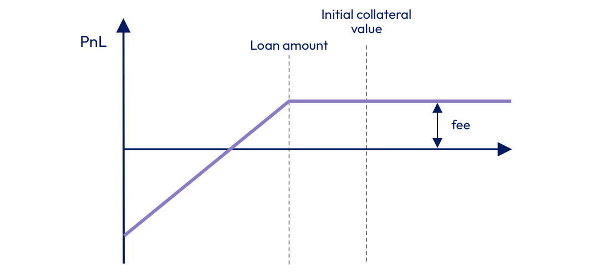

# Liquidity Providers

Liquidity providers simply deposit stablecoins in the available Lending pools and earn yield constantly without managing their positions.

Each position is represented as an NFT, which can be transferred or traded on a secondary market. Future versions of the protocol will include a native way to transfer positions.

Liquidity providers have a risk profile similar to put option sellers. However, being a liquidity provider in Cora has some benefits in comparison to simply selling put options.&#x20;

1\) Less capital requirements

2\) A simply way to accumulated the collateral in case of defaulted loans

3\) Automated risk management

We can see the position of the Liquidity provider in the following way:

<figure><figcaption>
Liquidity provider's position
</figcaption></figure>

As we can see, liquidity providers have an unlimited downside and a limited upside coming from borrowing fees.

In the Cora protocol, liquidity providers take the risk of the loans, however this risk is managed and constantly monitored to help liquidity providers don't go bankrupt.

If you want to learn more about the risk management engine of Cora, please Read the [Risk Management](../protocol-concepts/risk-management.md) section for more information.
