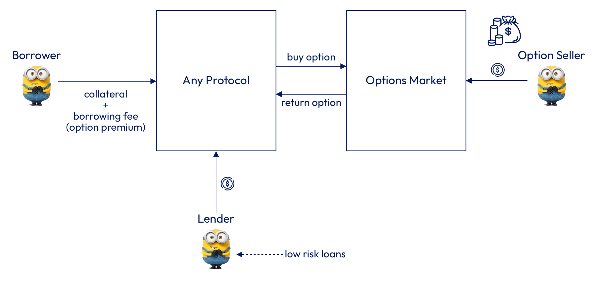
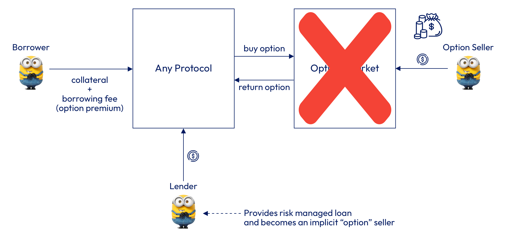

# How Cora works

The Cora Protocol is the first decentralized lending protocol that is powered by Option Strategies to manage the overall risk of a particular Lending Pool and to calculate the [Borrowing Fees](broken-reference) that borrowers should pay for a non liquidatable loan. This prevent Liquidity Providers to go bankrupt, since the protocol uses quantitative finance analysis methods to define the maximum amount that Liquidity providers should lend and the right Borrowing fee for the risk associated (see [Risk Management](risk-management.md) for more details).

**Introduction**

**European** **Put Options** are a financial instrument that allow the holder to sell a particular asset (underlying) at a certain price (strike price) on a certain date (expiration date). This type of financial instrument can also be use to protect user's assets when the price falls.&#x20;

For example,&#x20;

Imagine a user who has 10 ETH and 10 ETH Put Options with a strike price of $3000 that expire in 30 days.

If at expiration the price of ETH falls below $3000. The user can still sell the asset at $3000 due to the fact that he owns ETH Put Options.

Considering put options can work as a protection mechanism to ensure user's collateral, we could think of a lending platform where borrowers can provide an underlying asset plus a Put Option in order to get a loan in stablecoin for the value of the strike price. This is possible because in the worst case scenario, the lender can always exercise the Option using the borrower's collateral, and recover the total amount of stablecoin that was initially lent.

> Collateral + Put Option = Safe Loan

An architecture for such system could look like:

<figure><figcaption><p>Non liquidatable loans using Options </p></figcaption></figure>

Notice how the borrower could simply provide his collateral plus a borrowing fee for the non liquidatable loan. Then the protocol could abstract the complexity of buying an Option in an external Option's market and the lender would be able to provide a loan without risk, since the risk is being taken by the Option seller, who is getting paid a premium for doing so.&#x20;

**Limitations**

While the previous model could work, the economical incentive for lenders and borrowers wouldn't be very attractive. Lenders wouldn't be able to get high yields because most of the fees would go to the Option sellers and the only way to earn more fees would be by increasing Borrowing Fees that would affect directly to Borrowers, who would need to pay a higher Borrowing Fee.

Another limitation of this model is related with the liquidity of the Options, i.e how do we ensure there is always an available Option to be bought in the external Option's market?

Considering that the most important actor of a protocol of such type is the Lender or Liquidity Provider, how can we design a protocol that gives to lenders enough economic incentives while safe guarding their funds?

**The Cora Way**

The great Cora innovation relies on the removal of the Option Sellers from the previous protocol design.&#x20;

The Cora protocol doesn't have Option sellers, the Liquidity Provider becomes a lender that implicitly uses an Options Strategy to minimise the probability of ending In The Money (ITM), in other words, to minimise losing capital.

The combination of Options strategies, a robust Risk Management framework and Pricing Models gives Cora other advantages in terms of capital efficiency and simplicity.

<figure><figcaption><p>The Cora way</p></figcaption></figure>

**How it works**

**1)** Considering each [Liquidity Pool](lending-pools/) has associated an Option strategy that defines the maximum percentage of a particular collateral value (LTV) that borrowers can borrow.

**For example,**&#x20;

The Liquidity Pool for ETH could have a LTV of 80%.&#x20;

It means that the borrower can get up to 80% of the ETH spot price at borrowing time. So we could define:

```
MAX_AMOUNT_TO_BORROW = CURRENT_ETH_SPOT_PRICE * 0.80
```

**2)** A borrower can come the platform, lock his ETH, select an expiration date and receive up to 80% of the ETH spot price in stablecoin minus the borrowing fee.&#x20;

**For example,**&#x20;

The ETH spot price at borrowing time is $4000, then he can get up to $3600 in stablecoin minus let's say $200 of borrowing fee.

So we could define:

```
AMOUNT_BORROWED = MAX_AMOUNT_TO_BORROW - BORROWING_FEE
```

In our example, he will effectively get:

```
AMOUNT_BORROWED = 4000 * 0.80 - 200 = $ 3000
```

**3)** At expiration time, the borrower has 2 options:

1. Repay the loan and recover his ETH
2. Let the loan expire (not repaying) and keep the initial stablecoin borrowed

Both cases are up to the borrower, he can decide what is best, however economically speaking this will depend of the ETH spot price at expiration.&#x20;

**Let's analyse both cases:**

**Case 1: Price goes up**

If at expiration the ETH price is $5000. Then the borrower has the economic incentive to come back to the platform and repay his loan, since the ETH value is higher than the amount of stablecoin he initially borrowed.

**Case 2: Price goes down**

If the price of ETH is less than $4000, let's say $2800. The borrower doesn't have an economic incentive to repay his loan, since he can buy 1 ETH in a secondary market for a price of $2800.&#x20;

In fact, if this particular case he will end up making a profit, because they initially got $3000 and he can buy 1 ETH for $2800, making a profit of $200.

**Conclusion**

The Cora protocol is an innovative Defi protocol design that allow borrowers to get fixed term loans without liquidations. It solves the liquidation problem in a very elegant way that also provides benefits in terms of capital efficiency, so that borrowers can get more of their assets without having to worry about price decreases.

For more details about how the Cora protocol protects Liquidity Providers to avoid losing capital, please refer to the [Risk Management](risk-management.md) section.

~~~~

~~~~


