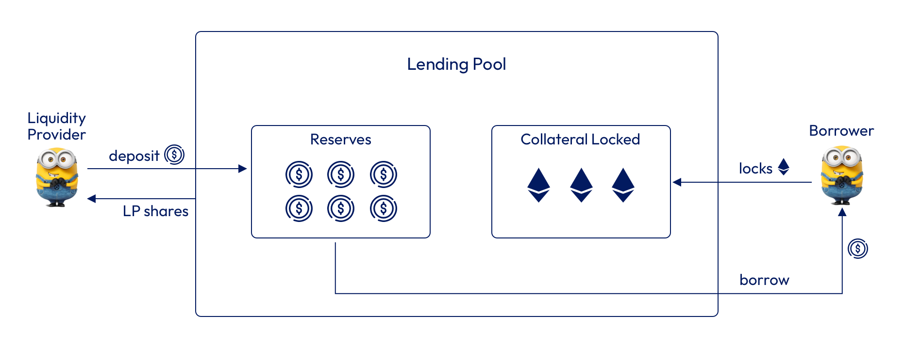

# Lending Pools

#### Introduction

**Lending pools** in Cora are single asset pools of **stablecoins**, where users or **liquidity providers** deposit any of the supported stablecoin **** tokens in exchange of a Cora LP token that represents the share of the pool.

Lending pools serve as a source of liquidity for loans. Borrowers will lock their collateral in exchange for a stablecoin token that will be taken from the lending pool reserves.

<figure><figcaption></figcaption></figure>

**Borrowing Fees**

Every time a borrower takes a loan, it is required to pay a one time **borrowing fee.**

The borrowing fees go to the liquidity providers and are distributed proportionally to the liquidity provider's share of the lending pool.

Lending pools have associated a **** [Price model](../pricing-models.md) **** smart contract that can be changed via governance.&#x20;

These models are based on Option's pricing models and calculates what is the right amount that a liquidity provider should charge to the borrower for the risk of providing a non liquidatable loan.&#x20;

For more information about how borrowing fees are calculated, see the [Borrowing Fees](../borrowing-fees.md) section.

<figure><figcaption>
Lending pool and price models
</figcaption></figure>

**Lending Pool Strategy**

All lending pools have a borrowing strategy associated. The strategy will define what is the maximum amount of stablecoins that the borrowers can borrow based in the different types of collateral.

The strategy uses quantitative finance analysis methods and incorporates in its analysis external market conditions and variables like implied volatility to define a general **loan to value (LTV).**

The main goal of the strategy is to define a set of parameters that have the goal of maximising the risk-reward relationship based on quantitative financial theory, that is backtested and adaptable.&#x20;

.jpg>)

For more information about the Risk Management, please check the [Risk Management](../risk-management.md) section.

#### **Pool Parameters**

_**Collateral token**_

The collateral that the Lending pool will accept in order to provide a loan.

_**Stablecoin token**_

The stablecoin that the Lending pool will accept as liquidity and to offer a loan.

_**Max LTV**_

The Lending pool strategy will define what is the maximum amount of stablecoins that the borrowers can borrow based in the different types of collateral, we call this process maximum LTV selection.

For example:

Using ETH as collateral, the strategy can define a maximum LTV of 80%.

Then a user can borrow up to 80% of their ETH spot price at borrowing time.

_**Price model**_

Each Lending pool can have a different price model. This price model can be changed and upgraded via governance (see the [Pricing Models](../pricing-models.md) section for more details).

_**Price feed**_

At borrowing time, the Lending pool will verify the current collateral value in order to validate that the amount requested is lower than the maximum LTV. The price feed address is a Chainlink data feed for the particular collateral.

_**Minimum amount to borrow**_

_**Minimum amount to deposit**_

_**Maximum cap**_

_**Round duration**_

_**Genesis round duration**_

#### **Risks**

As in any other system where users provide liquidity, there are risks inherent of the nature of a decentralized system, like hacks or black swan events that could make the markets crash.

However, we have worked in trying to minimise them, by auditing our code (see [Audits](../../security/audits.md) section), defining procedures for contingency and unexpected situations and by having a Risk Management framework that has been backtested and simulated (see the [Risk Management ](../risk-management.md)section for more details).&#x20;

****

****
