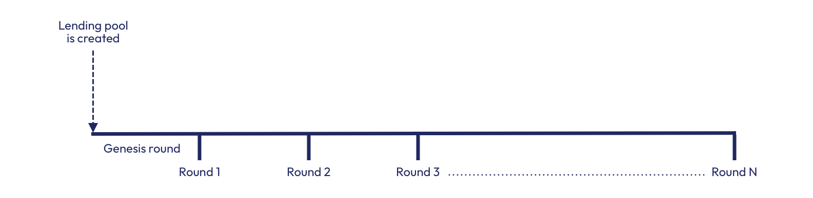
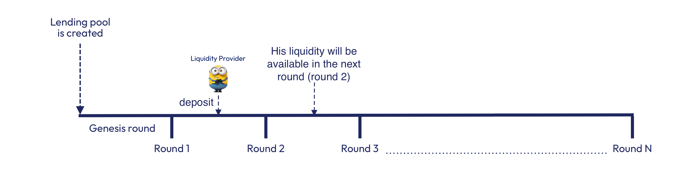
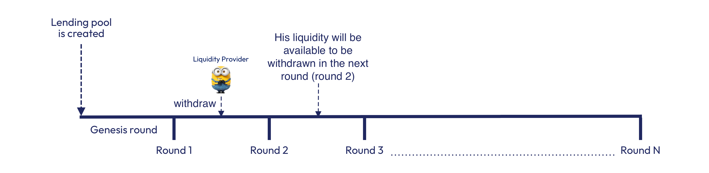

# Rounds

Lending pools run perpetually, they are unstoppable and immutable.

To learn more about rounds, let's start with a simple analogy. We can visualise Lending pools as a bus, a bus needs gasoline(or maybe electricity but it requires a source of energy) in order to be able to work. In the same way, Lending pools require liquidity to be able to provide loans to borrowers.&#x20;

Once a Lending pool is created, a predetermined period of time called "round" will start. Since it is the first round we called "Genesis round". This is the time where we load the tank (liquidity).

<figure><figcaption>
Analogy of a Lending pool
</figcaption></figure>

Once the bus starts its journey, it has to stop in multiple stations and people can leave the bus while others join. One thing to keep in mind is that people in the bus will be able to signal that they want to stop in the next station and people who want to take the bus can signal it too.

In the same way, Lending pools in Cora allow users to signal their deposits and withdrawals but they are only able to enter or exit in the next round. While this has impact in the user experience, it has some benefits from the implementation point of view. Since in Cora, rewards and defaulted loans cannot be fully known till the end of each round.&#x20;

This mechanism prevents also liquidity providers who want to exit the pool if for instance the pool is underperforming, which can create dynamics where the faster liquidity providers will exit before the others, which would be unfair.

The version 1 of the Cora protocol defines a genesis round of 1 week and rounds of 28 days. This means liquidity providers have to commit their liquidity till the end of the round, in other words for at least 28 days.

The life cycle of a Lending pool is as follows:

<figure><figcaption>
Visualisation of the Lending pool lifecycle
</figcaption></figure>

Deposits will looks like:

<figure><figcaption>
Visualisation of the Lending pool deposits
</figcaption></figure>

Withdrawals will look like:

<figure><figcaption>
Visualisation of the Lending pool withdrawals
</figcaption></figure>

Keep in mind that at any point in time users can deposit and withdraw, however their liquidity or withdrawals won't be active till the next round.&#x20;

Some exceptions can happen if the deposit and withdrawals are within the same round. Since the liquidity hasn't been **"activated"** it is still possible to cancel any action within the same round.

