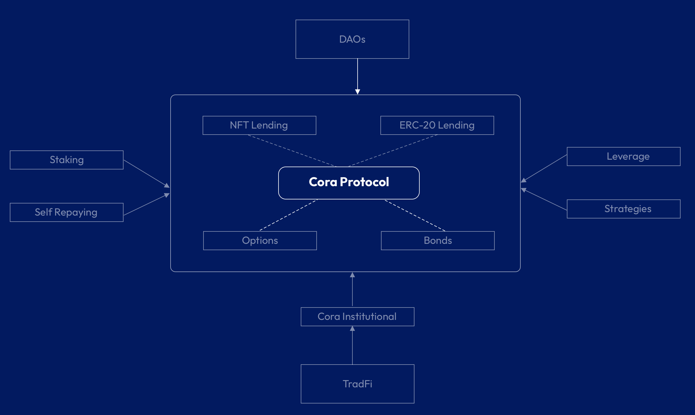

# Vision

Cora is a new protocol type that can serve as a money lego and fundamental block for future applications that can take advantage of a non-liquidatable base layer.&#x20;

Some of the applications we envision can be built on top of Cora and we plan to develop some of them or support via grants are:

Leverage Vault&#x20;

A product where users can deposit their ETH, then the Vault will buy more ETH and sell once a certain spot price is reached. Then the vault can sell the ETH, pay the debt and recover the ETH that was initially locked.&#x20;

Yield Farming Vault&#x20;

A product where users can deposit their ETH and the Vault can get a loan and use the funds to provide liquidity to the protocol and earn yield.&#x20;

Staking Vault&#x20;

A product where users can deposit their ETH, then the vault will stake the ETH and use the stETH to get a loan and provide liquidity to the protocol, earning fees for staking and for being liquidity provider in the Cora protocol.

We invite the community to help us to find new use cases and build on top of Cora.

<figure><figcaption></figcaption></figure>
